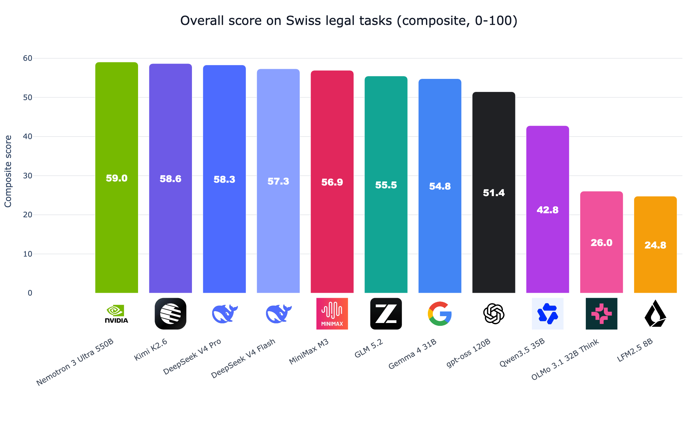
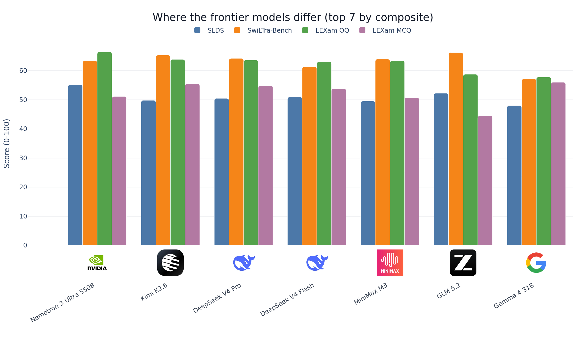
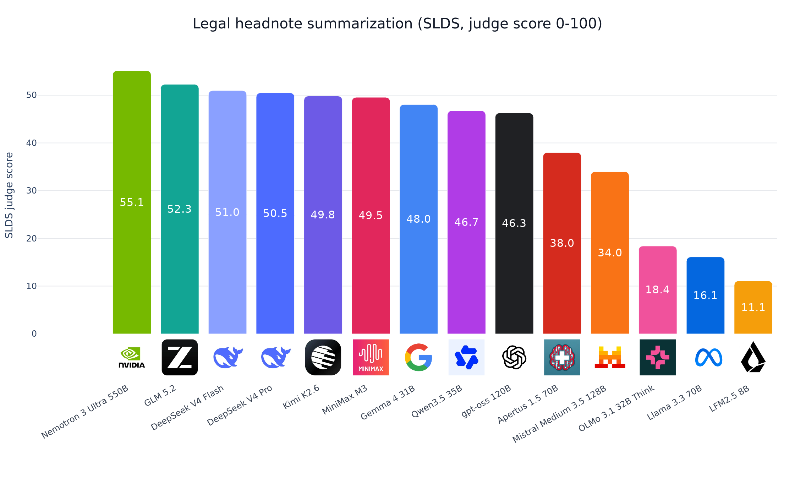
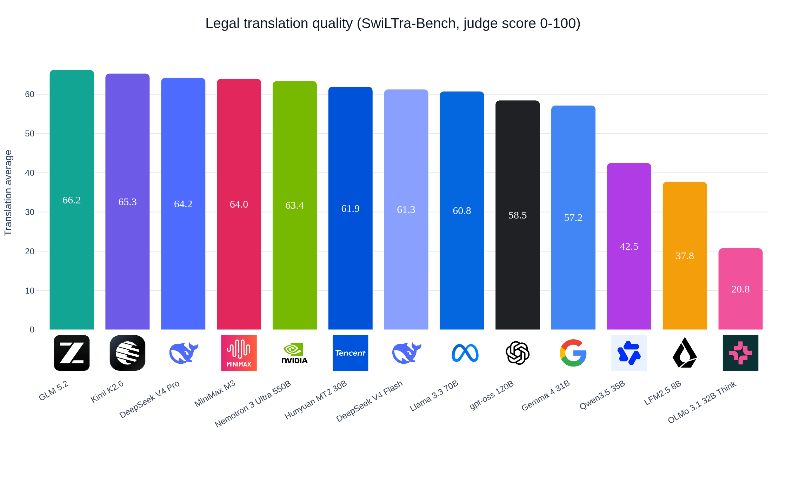
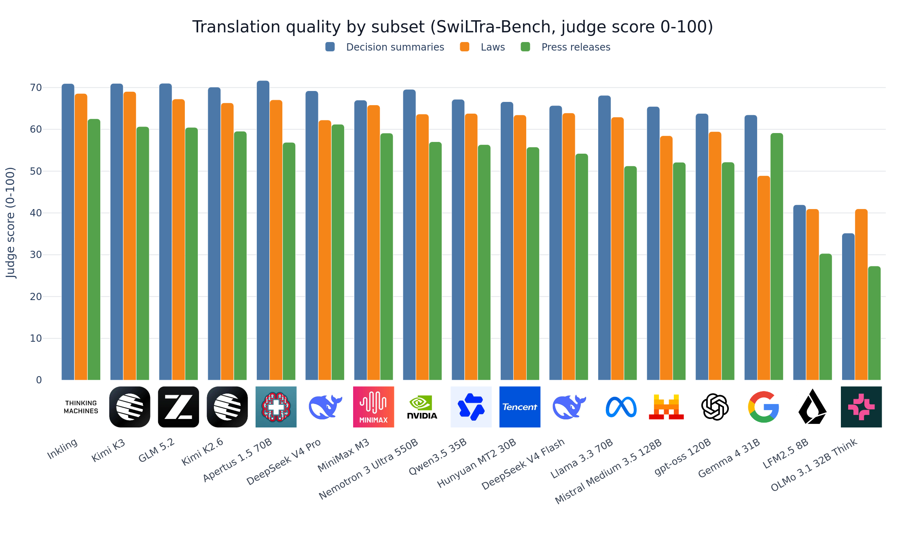
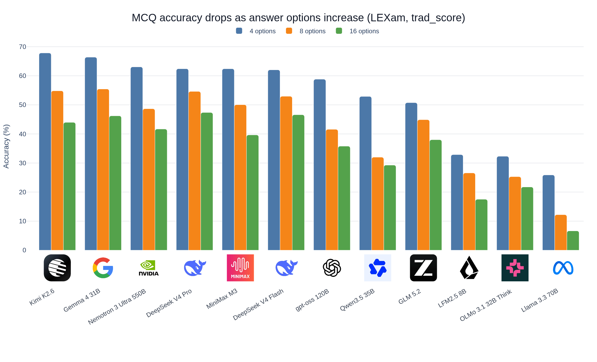
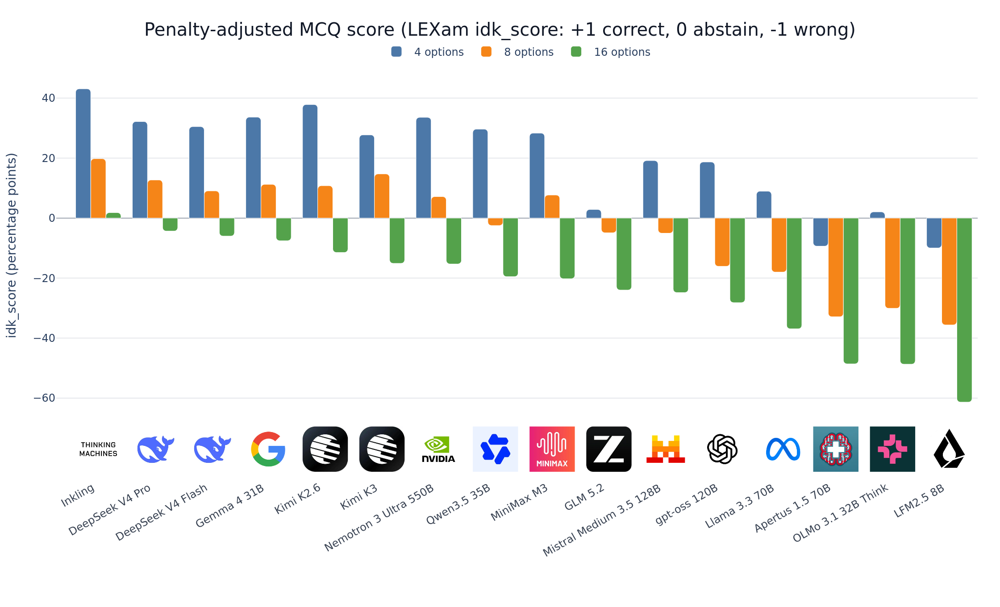
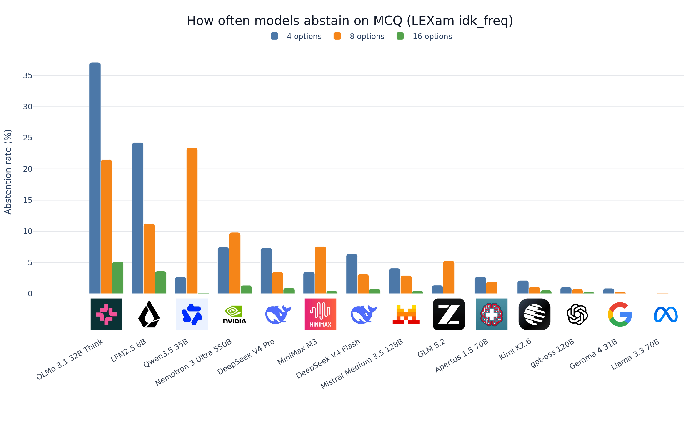
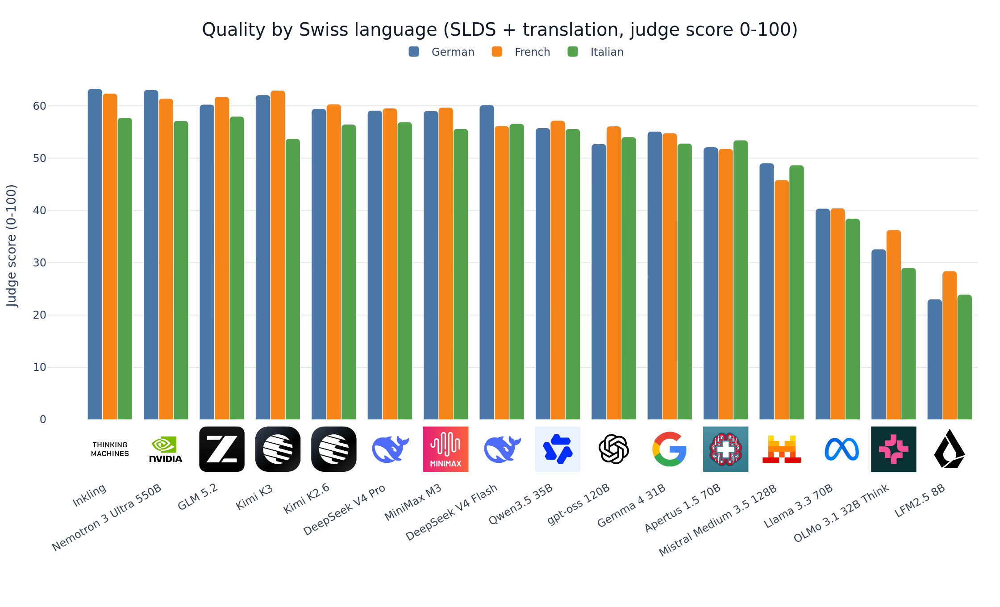

# The state-of-the-art in open-source AI for Swiss legal tasks

*Joel Niklaus · August 4 2026*

If you need an open-weight LLM for Swiss legal work in German, French, or Italian, the answer in 2026 depends on the task and on what you can afford to serve. We evaluated 17 open models on three Swiss legal benchmarks, 55,861 scored samples each for the 16 that ran the full set, and ranks two through seven finish within 2.1 points of each other on our composite score.

One model does lead almost everywhere: Thinking Machines' Inkling tops three of the four task groups. But its 3.3-point margin is smaller than the uncertainty on the score, and at roughly 1.9 TB of BF16 weights it is the most expensive model here to serve. So the useful question is not "which open model is best" but "best at what, on hardware you can actually run."

This post is for anyone deciding which open model to run on Swiss legal text and wanting current numbers instead of vibes. All results come from a single full run: the raw outputs live in the public [Hugging Face bucket](https://huggingface.co/buckets/joelniklaus/SwissLegalEvals), and the [`run.py` entry point](https://github.com/JoelNiklaus/SwissLegalEvals/blob/main/src/swiss_legal_evals/run.py) reproduces every number below.

**TL;DR:** Inkling scores highest overall (62.3) and leads translation, open questions, and multiple choice, but needs a 14-GPU server. Nemotron 3 Ultra is the best summarizer and the strongest model that fits on four H100s. Gemma 4 31B is the local-deployment pick: 54.8 overall and second on MCQ from a single GPU. Apertus 1.5 70B is the best model in the field at translating Swiss court decisions.



Inkling leads the composite at 62.3, ahead of Nemotron 3 Ultra 550B at 59.0. The five models behind them, from Kimi K2.6 down to MiniMax M3, all land between 58.6 and 56.9.

Ranks two through seven are effectively tied, and Inkling's lead is suggestive rather than established. A task-level bootstrap over the same result files (10,000 resamples within each benchmark family, [`scripts/bootstrap_composite.py`](https://github.com/JoelNiklaus/SwissLegalEvals/blob/main/scripts/bootstrap_composite.py)) gives 95% intervals with half-widths of 3.2 to 3.9 points for this tier — wider than both the 2.1 points from second to seventh and the 3.3 from first to second. That uncertainty matches recent LLM-as-judge work: [JudgeSense](https://arxiv.org/abs/2604.23478) finds equivalent prompt rephrasings can flip judge decisions, and [Li et al.](https://arxiv.org/abs/2506.22316) show score-based judges shift under rubric and reference-answer perturbations. The composite averages four task groups (SLDS summarization, LEXam open questions, translation, and MCQ), each on a 0-100 scale.

One pairing inside that tier is still curious: Kimi K3 (57.0) lands below its own predecessor K2.6 (58.6) despite carrying nearly three times the total parameters (2.8T versus 1T). The composite gap is inside the noise band, but the task-level pattern is not random — K3 gives up 5.7 points on LEXam open questions and 3.5 on MCQ while gaining slightly on translation and summarization, and the release's strong focus on coding and agentic performance could be what cost it on the legal side.

The gap only becomes decisive further down, with one exception. Gemma 4 31B reaches 54.8 overall, ninth and within 0.7 of GLM 5.2 (55.5), striking for a 31B model sitting among the 500B-class frontier. Size alone does not explain the rest: Qwen3.5 35B (50.0), a mixture-of-experts activating only 3B parameters per token, finishes ahead of Mistral Medium 3.5 128B (48.1) and both dense 70B models, Apertus 1.5 70B (45.2) and Llama 3.3 70B (39.9). OLMo 3.1 32B Think is dense and Gemma's size yet scores 30.6, a little over half as well, and LFM2.5 8B (24.8), the only genuinely small model here, sits at the bottom. None of these lower-tier models are ready for Swiss legal work yet.

One property the scores do not capture: Apertus 1.5 70B and OLMo 3.1 32B Think are the field's only open-data models, publishing their training corpora and pipelines rather than just the weights. For courts, administrations, and other public-sector buyers, that auditability can weigh as much as a few composite points, since you can inspect what the model was trained on instead of taking it on trust.

## What we measure: three Swiss legal benchmarks in three languages

Swiss law is written in German, French, and Italian, and all three benchmarks cover the multilingual case. We score generative tasks with LLM judges from the benchmarks' own papers rather than BLEU or ROUGE, because those papers show lexical overlap correlates poorly with human judgment on legal text.

- **SLDS** ([Rolshoven et al., 2025](https://arxiv.org/abs/2410.13456)): write a legal headnote for a Swiss Federal Supreme Court leading decision. Judged 0-100 by DeepSeek V4 Pro on a 5-rubric prompt.
- **SwiLTra-Bench** ([Niklaus et al., 2025](https://arxiv.org/abs/2503.01372)): legal translation across court decisions (`sdst`), laws (`slt`), and press releases (`sscprt`). Judged 0-100 by gpt-4o-mini against a codebook. We report the mean of the three.
- **LEXam** ([Fan et al., 2026](https://arxiv.org/abs/2505.12864)): law-exam open questions (judged 0-100 by DeepSeek R1) plus multiple-choice questions scored by accuracy at 4, 8, and 16 answer options.

Every model runs in its **default reasoning configuration**. We never pass a thinking toggle in either direction, so each model reasons exactly as its own chat template ships it. Before scoring we strip the trace so the judges and the multiple-choice letter extractor see only the final answer: tagged traces (`<think>`, `<reasoning>`), including the templates that pre-seed the opening tag into the prompt and leave only the closing tag in the completion, and harmony-style channel markers. Models that reason in unmarked prose, Nemotron 3 Ultra being the clearest case, cannot be cleaned this way. On the judged tasks they open with the answer anyway, and on multiple choice the score comes from the explicit answer marker at the end, so the monologue does not reach the metric.

## Where the frontier models differ: pick by task and hardware, not by rank

Averaging into one number hides where these models diverge. Choose on the per-group view instead.



Inkling is the broadest model in the field, leading translation (67.4), LEXam open questions (67.7), and MCQ (60.7). The one group it does not win is summarization, where Nemotron 3 Ultra takes SLDS at 55.1 against Inkling's 53.4. GLM 5.2 is the specialist counterexample: third at translation (66.2, within 1.2 of the top) but weakest of this tier on LEXam open questions (58.8) and MCQ (44.6), which is why it sits eighth overall.

So the choice comes down to what you run and where. For translation, Inkling, Kimi K3 (66.9), and GLM 5.2 (66.2) are separated by 1.2 points, so pick on serving cost. For summarization, Nemotron 3 Ultra is the clear choice and the most practical of the leaders, since NVFP4 weights let it run on four H100s. For open-ended legal reasoning, Inkling and Nemotron lead. And if you need your own hardware, Gemma 4 31B is the standout: 54.8 overall and second on MCQ from a single GPU, while every model above it is a far larger MoE served in the cloud.

## Summarization is the hardest of the four task groups

Writing the headnote for a Federal Supreme Court leading decision is where open models are weakest: the best SLDS score is 55.1, against 67.4 for translation, 67.7 for LEXam open questions, and 60.7 for MCQ. The mean across the sixteen models that ran SLDS is 42.5.



Nemotron 3 Ultra leads at 55.1, the only model above 54, and this is the one group where it beats Inkling (53.4). Nine models are packed between 46.3 and 53.4, and below them the field falls off a cliff: Apertus 1.5 70B manages 38.0, Mistral Medium 3.5 128B 34.0, and the bottom three, from OLMo 3.1 32B Think (26.8) to LFM2.5 8B (11.1), do not reliably produce a usable headnote at all, the single biggest reason their composites collapse.

Two details qualify these numbers. SLDS is judged by DeepSeek V4 Pro, so the DeepSeek models could carry a self-preference bias, though both land mid-tier rather than first, which argues against a large effect. And headnote language matters: averaged over all models German scores 45.1, French 44.0, and Italian 38.4, and staying in the source language (44.2) beats translating across it (41.6).

## A 3B-active specialist nearly matches the frontier in translation

The models perform best in translation: fifteen of seventeen score at least 57 out of 100. Inkling tops it at 67.4, with Kimi K3 just behind at 66.9. Apertus 1.5 70B, the Swiss open model in this lineup, sits with the frontier MoEs here: fifth on the average at 65.2, and first of all seventeen on court-decision summaries at 71.7.





The efficiency surprise is Hunyuan MT2 30B, a translation specialist with only 3B active parameters (we ran it on SwiLTra-Bench only). It lands tenth at 61.9, within 5.5 points of the best open translator. The models ahead of it activate far more per token, from MiniMax M3's 23B up to Kimi K3's 104B, so a model with 8x to 35x fewer active parameters is close to the frontier. It does not win on raw quality, but no model here gets more out of each active parameter, which makes it the translation model to watch if you are compute-bound. If you only want the best output, the big MoEs still win.

## Not all legal text is equally hard to translate

SwiLTra-Bench splits into three document types, and they are not equally hard.



For the strong models the order is consistent: court-decision summaries are easiest, statutory law sits in the middle, press releases are hardest. Apertus leads decision summaries at 71.7, just ahead of GLM 5.2 and Kimi K3 (both 71.0), and every top-tier model ranks the subsets that way. Press releases separate the leaders most: Inkling manages 62.5 while Apertus drops to 56.9, which is what pulls its translation average below the top four.

Further down the field that order stops holding. Gemma 4 31B stays near the frontier on decision summaries (63.5) and press releases (59.2) but drops to 48.9 on statutory law, a 14.6-point spread, the widest in the field. OLMo 3.1 32B Think inverts the usual order, with statutory law its best subset (41.0) and press releases its worst (27.3). If your workload is one specific document type, these subset scores matter more than the average.

## Multiple-choice accuracy collapses as options grow

Every model degrades from 4 to 16 answer options, and the drop is steep. Multiple choice is the least realistic task in this set, since legal work rarely arrives as a labelled list of options: read it as a measure of exam-style background knowledge rather than of day-to-day usefulness.



Inkling falls from 71.4% at four options to 50.9% at sixteen, Kimi K2.6 from 67.9% to 44.0%, Nemotron from 63.1% to 41.7%. Nobody escapes the pattern, and the ordering of models is broadly stable across the three widths.

Model size does not protect against it. Gemma 4 31B posts an MCQ average of 56.0, second only to Inkling (60.7) and ahead of every 500B-class model here: on these exam questions a 31B dense model beats much larger MoEs. Apertus 1.5 70B is the other side of that coin, near-frontier on translation (65.2) but 33.8 on MCQ, third-lowest and about 22 points behind Gemma at every option count. Writing good legal German, French, and Italian is evidently a different skill from picking the right answer out of a list.

## Models guess instead of admitting uncertainty

The `trad_score` in the chart above treats "I don't know" as simply wrong. LEXam also reserves the last letter for abstention and reports `idk_score`, which awards +1 for a correct letter, 0 for abstaining, and -1 for a wrong or unparseable one. Read that metric if a wrong answer costs you more than a missing one, which in legal triage it usually does.



At four options, 14 of the 16 models come out positive, led by Inkling at 43.1 and Kimi K2.6 at 37.9. At eight options only eight are still above zero. At sixteen, exactly one is: Inkling, at +1.8, with the DeepSeek variants closest behind at -4.3 and -6.0 and LFM2.5 8B deepest in the red at -61.3. On a wide option set, almost every model here loses points by answering where it should have declined.



The abstention rates explain why, and they run backwards. Every model that abstains meaningfully at four options does so far less at sixteen, exactly where its chance of guessing right falls from one in four to one in sixteen. OLMo 3.1 32B Think is the most willing to decline, on 36.8% of four-option questions but only 3.4% at sixteen, and DeepSeek V4 Pro shows the same collapse from 7.3% to 0.9%. Llama 3.3 70B never abstains at all, and the two accuracy leaders barely do: Inkling declines on 0.2% of four-option questions and Gemma on 0.9%, and at sixteen they effectively never do (0.1% and 0.0%). Gemma's near-zero abstention mirrors Google's closed models on the same benchmark: in a [separate LEXam-IDK evaluation](https://www.linkedin.com/posts/joelniklaus_the-80-barrier-falls-ensemble-top3-new-activity-7408898384406966273-p7L0/), Gemini 3 Pro never abstains at all, and Gemini 3 Flash, the first Gemini model to ever pick "I don't know", does so on just 1.29% of questions. With almost nobody abstaining on the wide set, every answer scores either +1 or -1, so a model's 16-option `idk_score` is simply its accuracy minus its error rate. That is why it reproduces the accuracy ranking almost exactly: Inkling's 50.9% accuracy is what puts it at +1.8, just above break-even. What the metric adds is the level, not the order.

Two caveats. Unparseable answers also score -1, so GLM 5.2, which yields no extractable letter on 17.5% of questions on average, is penalized partly for formatting rather than for guessing. And abstention has to be earned: OLMo's readiness to decline comes with an MCQ average of 27.7%, second-lowest in the field. In practice, only Inkling gets more answers right than wrong at sixteen options, so if a wrong answer is costly you have to add your own confidence check rather than rely on the model to decline.

## Italian is the hardest of the three Swiss languages

Averaging every German, French, and Italian task a model produces (SLDS plus the three translation subsets, the benchmarks covering all three languages) exposes a small but consistent gap.



French comes out highest (53.5 across the 16 comparable models), German is close behind (53.0), and Italian is last (50.5). The gap is about three points, German and French stay within half a point of each other, and Italian is the lowest of the three for 11 of the 16 models. Apertus 1.5 70B is the sole exception in the other direction: Italian (53.4) is its strongest language, possibly a result of its heavily multilingual training mix. The likely cause of the general gap is data volume, since Italian is the smallest of the three languages in Swiss legal corpora and on the open web. LEXam is left out because it exists only in German and English, which would make the comparison unequal.

## Model sizes and the hardware to run them

Two numbers decide the cost of serving a model: total parameters set how much memory the weights occupy, active parameters set how much compute each token costs. The field spans 8.5B to 2.8T total parameters, but the precision a checkpoint ships in often decides how many GPUs you need.

| Model                      | Total | Active | Precision | Weights  | Runs on       |
|----------------------------|------:|-------:|-----------|---------:|---------------|
| Kimi K3                    |  2.8T |   104B | INT4+BF16 | ~1.55 TB | 11x H200      |
| DeepSeek V4 Pro            |  1.6T |    49B | FP4+FP8   | ~0.85 TB | 8x H200       |
| Kimi K2.6                  |    1T |    32B | INT4      |  ~0.5 TB | 4x H200       |
| Inkling                    |  975B |    41B | BF16      |  ~1.9 TB | 14x H200      |
| GLM 5.2                    |  753B |    40B | BF16      |  ~1.5 TB | 11x H200      |
| Nemotron 3 Ultra 550B      |  550B |    55B | NVFP4     |  ~275 GB | 4x H100       |
| MiniMax M3                 |  428B |    23B | BF16      | ~0.85 TB | 7x H200       |
| DeepSeek V4 Flash          |  284B |    13B | FP4+FP8   |  ~150 GB | 2x H100       |
| Mistral Medium 3.5 128B    |  128B |   128B | FP8       |  ~128 GB | 2x H100       |
| gpt-oss 120B               |  117B |   5.1B | MXFP4     |   ~60 GB | 1x H100       |
| Llama 3.3 70B              |   70B |    70B | BF16      | ~140 GB  | 2x H100       |
| Apertus 1.5 70B            |   70B |    70B | BF16      | ~140 GB  | 2x H100       |
| Qwen3.5 35B                |   36B |     3B | BF16      |   ~72 GB | 1x H100       |
| Gemma 4 31B                |   33B |    33B | BF16      |   ~65 GB | 1x H100       |
| OLMo 3.1 32B Think         |   32B |    32B | BF16      |   ~64 GB | 1x H100       |
| Hunyuan MT2 30B            |   30B |     3B | BF16      |   ~60 GB | 1x H100       |
| LFM2.5 8B                  |  8.5B |     1B | BF16      |   ~17 GB | 1x 24 GB GPU  |

Weights are total parameters times bytes per parameter (BF16 = 2, FP8 = 1, INT4/FP4 = 0.5), before the KV cache that long context adds; GPU counts assume 80 GB (H100) or 141 GB (H200) cards. Precision can outweigh size outright. Kimi K2.6 has more total parameters than GLM 5.2 (1T versus 753B), but ships as INT4, so its weights (~0.5 TB) are a third of GLM's BF16 footprint (~1.5 TB). The same inversion appears at the top: Kimi K3 carries nearly three times Inkling's parameters (2.8T versus 975B) yet needs less memory (~1.55 TB versus ~1.9 TB), because it ships mostly quantized while Inkling ships in BF16. Mistral Medium 3.5 is a dense 128B in FP8 (~128 GB), so it fits where a BF16 twin would not. Eleven of the seventeen models need a multi-GPU server; the other six fit on one accelerator, five of them on a single 80 GB H100.

This is where the ranking and the hardware pull against each other. Inkling wins the composite but is the heaviest model in the table, needing roughly fourteen H200s because it ships in BF16. Nemotron 3 Ultra, one rank below and statistically indistinguishable, fits on four H100s thanks to NVFP4, making it the most practical of the leaders by a wide margin. And Gemma 4 31B delivers 54.8 overall from a single GPU, 7.5 points behind the top of a field where every model above it needs several.

## Limitations

The composite is indicative, not normalized: it mixes judge scores with rescaled MCQ accuracy, so the per-group charts are the ground truth. SLDS is judged by DeepSeek V4 Pro, so the DeepSeek models' summarization scores may carry a mild self-preference bias. SwiLTra-Bench is scoped to the lowest granularity per dataset here; the full profile adds finer levels and roughly 87k samples per model. And Hunyuan MT2 30B ran translation only, so it is absent from the composite, SLDS, LEXam, and profile charts.

## Conclusion

The open frontier on Swiss legal tasks is close, and only one model is broad. Inkling leads three of the four groups, but by less than the uncertainty on the score, and the six models behind it finish within 2.1 points of each other. The right pick depends on the job and the hardware. If you can serve anything, Inkling is the best model overall and Nemotron 3 Ultra the best summarizer. If the GPU budget is the binding constraint, the value picks are Apertus 1.5 70B for translation, DeepSeek V4 Flash for summarization, and Gemma 4 31B for LEXam, each the strongest at its task among the models that fit on one or two accelerators. Small models also win on electricity: a dense 32B model measures at roughly 0.15-0.3 J per generated token on a single GPU, while Kimi K3's 104B active parameters spread over eleven GPUs put it nearer 1-2 J, because energy tracks active parameters and every extra GPU adds static power ([Where Do the Joules Go?](https://arxiv.org/abs/2601.22076)). Gemma 4 31B therefore does its share of the legal work for something like five to ten times less energy than the largest models in this field, and with a correspondingly smaller environmental footprint. Apertus makes the specialization point most sharply: the best model in the field at translating court decisions, yet thirteenth of sixteen overall because summarization (38.0) and multiple choice (33.8) pull it down. Absolute quality is not there yet either: the strongest model scores 67.7 on open legal exam questions and 50.9 on 16-option multiple choice, and no other model clears 48 on the latter, so a lawyer still has to check the output on real matters.

## What this means for the Swiss Justice Base Model

Apertus 1.5 demonstrates that the Swiss Justice Base Model (initiative from the Swiss Federal Supreme Court, the eJustice association and SwissAI) is on the right path. While it is not yet competitive across every benchmark — particularly multiple-choice legal reasoning — it already delivers frontier-level performance in multilingual Swiss legal translation, achieving the best results for Swiss court-decision translations, beating even models up to forty times its size. Even more importantly for the Swiss judiciary, Apertus is fully transparent and auditable, with openly published training data and pipelines, a rare characteristic among leading models. For courts and public administrations, this transparency, together with its strong performance on core judicial translation tasks and its ability to run securely on-premises, makes Apertus an excellent foundation on which the Swiss Justice Base Model can continue to improve through further domain-specific training and alignment.

## Reproduce this

The three benchmarks are integrated directly into [lighteval](https://github.com/huggingface/lighteval), including the paper-grounded LLM judges, so the whole pipeline — generation, judging, aggregation — is one command on any model you point it at, rather than a pile of glue scripts.

The full-run results, the figures above, and the underlying tables live in the public bucket [`joelniklaus/SwissLegalEvals`](https://huggingface.co/buckets/joelniklaus/SwissLegalEvals). To regenerate the charts:

```bash
uv sync --extra dev   # figure export needs kaleido, in the dev group
hf buckets sync hf://buckets/joelniklaus/SwissLegalEvals/summary.csv results
uv run python blog/make_figures.py   # writes blog/figures/*.png
```

The evaluation code lives in the same [SwissLegalEvals repository](https://github.com/JoelNiklaus/SwissLegalEvals). To score a new model, add one entry to [`configs/models.yaml`](https://github.com/JoelNiklaus/SwissLegalEvals/blob/main/configs/models.yaml). For a model served through Hugging Face inference providers:

```yaml
# configs/models.yaml
- name: my-model
  provider: hf-inference-providers
  model: org/My-Model
  hf_provider: fireworks-ai
```

For a model you host locally with vLLM, set the parallelism instead:

```yaml
- name: my-model
  provider: vllm
  model: org/My-Model
  tensor_parallel_size: 4
  max_model_length: 65536
```

Put the provider key in `.env` (`HF_TOKEN`, `OPENAI_API_KEY`, or `OPENROUTER_API_KEY`), then run the model and rebuild the tables and charts:

```bash
uv run swiss-legal-evals --models my-model --max-samples 5   # quick smoke test; drop --max-samples for the full run
uv run swiss-legal-evals-aggregate
uv run swiss-legal-evals-plot
```

Add `--dry-run` to print the underlying lighteval commands without calling any API.
